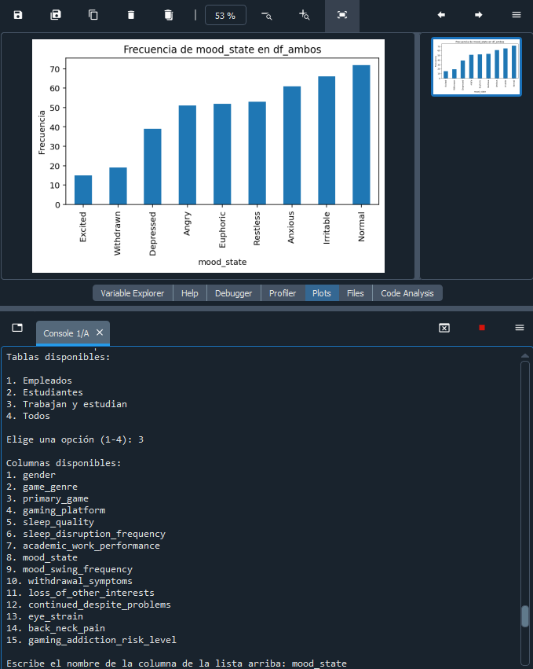

# StreamlineVisualization

This is a menu that was created using simple functions in python, it's objective is to streamline the visualization process of a table by asking which columns should be paired in order to create a graph.

The project was made in Spanish, but an English version is on the works. 

If you want to try this yourself, you may find the .csv file used for the database in this folder, simply replace the file location between "" in line 12 after downloading it.

